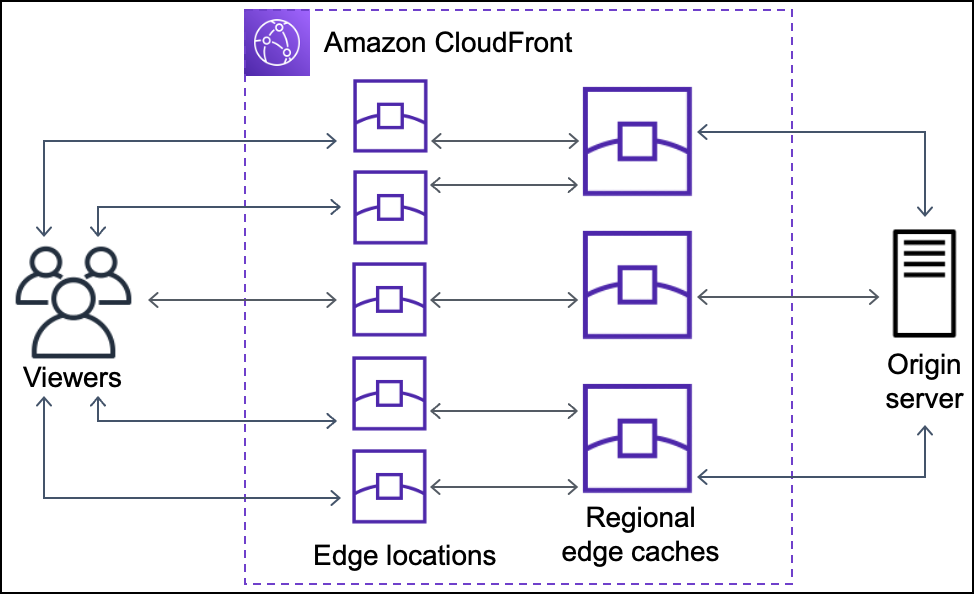

とりあえずcloudfrontとはなんぞやというところから...
https://aws.amazon.com/jp/cloudfront/
要するにAWSのCDNサービスのことらしい。CDNそのものはセキュリティ対策というか読み込み高速化のための
キャッシュサーバみたいなやつだったような...?
いちいちオリジンサーバに接続しないで、キャッシュサーバを経由させると高速にページローディングできるから、世界のいろんなところにキャッシュサーバのネットワークをおいておいて、ユーザになるべく物理的に近い位置のサーバから呼び出しますとか
https://docs.aws.amazon.com/AmazonCloudFront/latest/DeveloperGuide/Introduction.html

https://docs.aws.amazon.com/AmazonCloudFront/latest/DeveloperGuide/HowCloudFrontWorks.html
上の説明では本当にただのキャッシュサーバっぽい。
ユーザに近くていっぱい存在する小さめのエッジロケーション(CloudFront PoP)と、それよりは少ないけど大きめのリージョンエッジキャッシュを組み合わせているらしい


https://docs.aws.amazon.com/AmazonCloudFront/latest/DeveloperGuide/getting-started-secure-static-website-cloudformation-template.html
↑が安全なWebsiteの作り方みたいなのの説明
https://docs.aws.amazon.com/acm/latest/userguide/acm-overview.html
ここのACMとかいうのをアタッチするとHTTPS接続できるということなので、CloudFrontというよりACMが主体としてセキュリティを担っているのかも
SSL/TLSを使うには、認証局の認可サーバに証明書を置いておく必要があるはずなので、そこら辺の処理を勝手にやってくれるのが嬉しいポイントか

とりあえず作ってもらうことにした ACMを使ってと言ったら、自分の取得ずみのドメインを要求されたので、持っていないと言ったらCloudFrontのデフォルトで運用可能らしい

```bash
 Error: No valid credential sources found
│
│   with provider["registry.terraform.io/hashicorp/aws"],
│   on main.tf line 18, in provider "aws":
│   18: provider "aws" {
│
│ Please see https://registry.terraform.io/providers/hashicorp/aws
│ for more information about providing credentials.
│
│ Error: failed to refresh cached credentials, create oauth2 token: login
│ session has expired, please reauthenticate
```
ログイン失敗したっぽいので `aws login`をやり直す
```bash
Note: You didn't use the -out option to save this plan, so Terraform can't
guarantee to take exactly these actions if you run "terraform apply" now.
```
と出るものの成功。`terraform plan`をしたときに`-out`オプションでセーブしていないため、`terraform apply`をしたときに全く同じ動きをすることは保証できませんよということか（前回もdepends_onのときに似たようなことがあったが、terraformの内部のビルドの順番とかはよくわかんない部分があるので、planの時はうまく行っていたがapplyの時に失敗するかもしれんよということだと思う）

と言っている間にビルドが終了。
https://d2xkjehl25xbnc.cloudfront.net/
からアクセスできた。 `main.tf`の中身を見ると、

```terraform
# CloudFront OAC からのアクセスのみ許可するバケットポリシー
resource "aws_s3_bucket_policy" "website" {
  depends_on = [aws_s3_bucket_public_access_block.website]

  bucket = aws_s3_bucket.website.id

  policy = jsonencode({
    Version = "2012-10-17"
    Statement = [
      {
        Sid    = "AllowCloudFrontServicePrincipal"
        Effect = "Allow"
        Principal = {
          Service = "cloudfront.amazonaws.com"
        }
        Action   = "s3:GetObject"
        Resource = "${aws_s3_bucket.website.arn}/*"
        Condition = {
          StringEquals = {
            "AWS:SourceArn" = aws_cloudfront_distribution.website.arn
          }
        }
      }
    ]
  })
}
```
Condition: AWS:SourceArn = aws_cloudfront_distribution.website.arn
なので、このCloudFront Distributionから来た要求のみ許可するという仕組みになっているということだそうだ。
ちなみにARNというのはAWSのリソースに対して一意に設定されるidのこと
DNS的にみても、net -> cloudfront -> xxxという感じで遷移するので、S3にアクセスするのにcloudfrontを経由しているなというのはなんかわかるような...

これはS3へのURL直通を不許可にすることができているはずなので、
https://tf-s3-website-https-3c291bfe.s3.ap-northeast-1.amazonaws.com/index.html
としたら、
```xml
<Error>
<Code>AccessDenied</Code>
<Message>Access Denied</Message>
<RequestId>---</RequestId>
<HostId>---=</HostId>
</Error>
```
と出たので、うまく行ってそう！

Webの正規機能としては、net -> cloudfront -> xxxとするだけのはずなので、一度cloudfrontの権威サーバを通って、その上でその権威サーバがユーザの位置によって最適なPoPを選択するということなのかな

一回目
ブラウザ
   ↓
ISP DNS
   ↓
Route53 (cloudfront.net権威DNS)
   ↓
東京PoPのIPが返る

二回目
ユーザ
   ↓
東京PoP（キャッシュヒット）
   ↓
完了
ということになるのか

```bash
; <<>> DiG 9.10.6 <<>> d2xkjehl25xbnc.cloudfront.net
;; global options: +cmd
;; Got answer:
;; ->>HEADER<<- opcode: QUERY, status: NOERROR, id: 10521
;; flags: qr rd ra; QUERY: 1, ANSWER: 4, AUTHORITY: 0, ADDITIONAL: 1

;; OPT PSEUDOSECTION:
; EDNS: version: 0, flags:; udp: 1232
;; QUESTION SECTION:
;d2xkjehl25xbnc.cloudfront.net.	IN	A

;; ANSWER SECTION:
d2xkjehl25xbnc.cloudfront.net. 60 IN	A	3.173.222.-
d2xkjehl25xbnc.cloudfront.net. 60 IN	A	3.173.222.--
d2xkjehl25xbnc.cloudfront.net. 60 IN	A	3.173.222.---
d2xkjehl25xbnc.cloudfront.net. 60 IN	A	3.173.222.----

;; Query time: 15 msec
;; SERVER: ----------#53(----------)
;; WHEN: Sat Feb 28 12:38:46 JST 2026
;; MSG SIZE  rcvd: 122
```
となった。つまり、4つくらいに分散している。これらのipはAnyCast IPというらしく、
同じIPアドレスを、地理的に離れた複数のサーバで共有する仕組み。

何で勝手に認証サーバ周りが進んでいくのかと思ったら、Amazonは自分で認証局を持っているらしい。
https://aws.amazon.com/jp/blogs/news/how-to-prepare-for-aws-move-to-its-own-certificate-authority/
つよつよのオレオレ認証局を持っているので、そこら辺が爆速でうまくいくということらしい


```terraform
resource "aws_cloudfront_origin_access_control" "website" {
  name                              = "oac-tf-s3-website-https-${random_id.suffix.hex}"
  origin_access_control_origin_type = "s3"
  signing_behavior                  = "always"
  signing_protocol                  = "sigv4"
}
```
AWS OACを作成
https://aws.amazon.com/jp/blogs/news/amazon-cloudfront-introduces-origin-access-control-oac/
```terraform
Condition = {
          StringEquals = {
            "AWS:SourceArn" = aws_cloudfront_distribution.website.arn
          }
        }
```
S3のバケットポリシーで、cloud front distributionのsource arnを持っていないと入れませんよ！という設定をした。しかし、cloudfront単体だとこのsource arnを利用できないので、sigv4を利用して送る。
SigV4 – 認証情報スコープには、アクセスキー ID、YYYYMMDD 形式の日付、リージョンコード、サービスコード、およびスラッシュ (/) で区切った aws4_request 終了文字列が含まれます。リージョンコード、サービスコード、および終了文字列には、小文字を使用する必要があります。
つまり、AWS CLIを利用しているのとおんなじ状態しているのと同様の状態になる。CloudFrontサービスがIAMサービスプリンシパルとして振る舞うので、source arnがIAMの評価の際に使われ、S3にアクセスできるということらしいです
```terraform
resource "aws_cloudfront_distribution" "website" {
  enabled             = true
  is_ipv6_enabled     = true
  default_root_object = "index.html"
  comment             = "tf-s3-website-https"
}
```

配信用のCDNの定義
```terraform
default_cache_behavior {
  allowed_methods        = ["GET", "HEAD"]
  cached_methods         = ["GET", "HEAD"]
  target_origin_id       = "s3-origin"
  viewer_protocol_policy = "redirect-to-https"
  compress               = true

  forwarded_values {
    query_string = false
    cookies { forward = "none" }
  }

  min_ttl     = 0
  default_ttl = 3600
  max_ttl     = 86400
}
```
forwarded_valuesでは、クエリパラメタやクッキーをキャッシュしないようにしている。
ttl(time to live)を設定している。
`viewer_protocol_policy = "redirect-to-https"`と書いてある。
http://d2xkjehl25xbnc.cloudfront.net/
↑でもhttpsにリダイレクトされた。