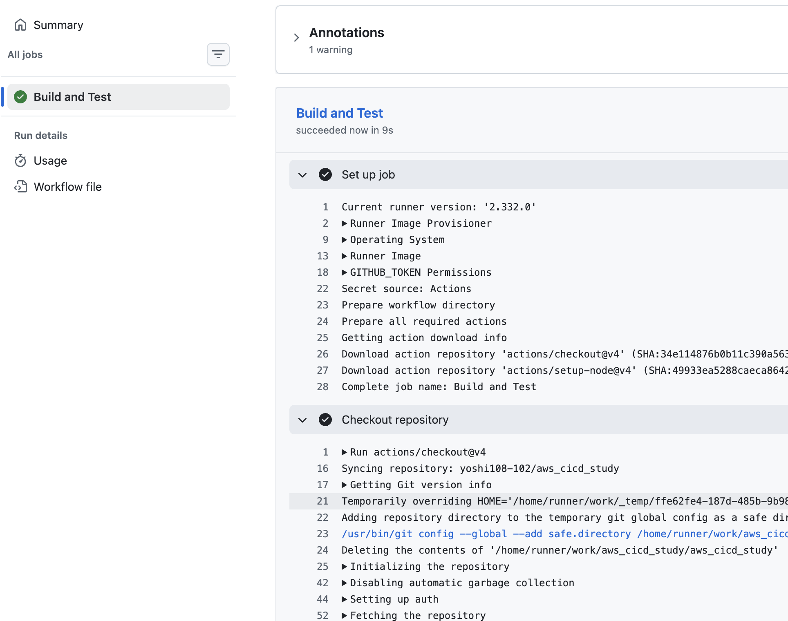
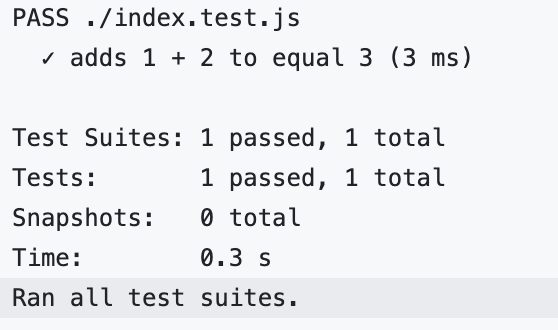
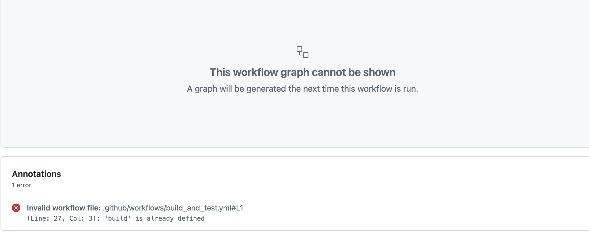

https://aws.amazon.com/jp/blogs/news/building-multi-arch-containers-with-github-actions-in-aws/

このURLを元に、GitHubを用いたCI/CDシステムについて学習する。


とりあえず一旦リポジトリを作成して試してみる

PC変えたのでdockerが入ってなかった。入れ直した


ローカルでdocker buildしたところ問題なく起動。

```dockerfile
FROM public.ecr.aws/nginx/nginx
COPY index.html /usr/share/nginx/html/index.html
EXPOSE 8080
CMD ["nginx", "-g", "daemon off;"]
```

`nginx`というのはエンジンエックスと読むらしく、オープンソースのWebサーバとのこと。
https://nginx.org/en/

awsの公式イメージを引っ張ってきて、`index.html`を /usr/share/nginx/html/にコピー。
コマンドを動かすという構成みたいだが、だいぶ変わっているような気がする。

ローカルで動かす時には
`docker run --rm -p 8080:80 my-nginx`
と打てと言われたが、dockerfileでEXPOSE 8080としているのに、こっちでもオプションでポートをしていているのはなぜなんだ

EXPOSEは特に意味のある命令ではない？？
https://docs.docker.jp/engine/reference/builder.html#expose


こっちの記事の方がやりたいことと近いのでこっちにします

https://developer.hashicorp.com/terraform/tutorials/automation/github-actions


まさにこれがやりたい

https://zenn.dev/farstep/books/learn-github-actions/viewer/basic-concepts-of-github-actions

その前にGitHub Actions全然イメージないので、これをみるとこからやるか

```yaml
name: Simple Workflow
on:
  push:
    branches: [main]
jobs:
  build:
    runs-on: ubuntu-latest
    steps:
      - uses: actions/checkout@v4
      - name: Run a script
        run: echo "Hello, World!"
```
yamlを使ってワークフローを`.github/workflow/`に定義する感じっぽい
GitHubに何かをした時に、それをトリガーして、jobsを実行する感じね


```yaml
on:
  push:
    branches: [main]
  pull_request:
    branches: [main]
----------
on:
schedule:
  - cron: "30 5,17 * * *"
```

これがイベント。リポジトリイベントとかスケジュールイベント、手動トリガーイベントとか色々なハンドラが用意されている。

ところで、`name`と`jobs`が同じ階層にあるということは、ワークフローはyamlファイル1つにつき1つ定義することができるという感じなのかな

```yaml
jobs:
  setup:
    runs-on: ubuntu-latest
    outputs:
      output1: ${{ steps.step1.outputs.result }}
    steps:
      - run: ./setup.sh

  build:
    needs: setup
    name: Build Application
    runs-on: ubuntu-latest
    env:
      VERSION: 1.0.0
    if: github.ref == 'refs/heads/main'

  test:
    needs: [build]
    runs-on: ubuntu-latest
    steps:
      - run: ./test.sh
```
これがjob
やれることがだいぶTerraformに近いというか、だいぶtfとの互換性を感じる

```yaml
steps:
  - name: Print a message
    run: echo "Hello, World!"

  - name: Multi-line script
    run: |
      echo "First line"
      echo "Second line"
      echo "Third line"
```
ステップは、ジョブ内で実行される個々のタスクを表す最小の実行単位です。各ステップは順番に実行され、一つのステップが失敗すると、通常そのジョブは中断されます。

```yaml
steps:
  - uses: actions/checkout@v4
    with:
      repository: "myorg/myrepo"
      ref: "main"
```
`actions/checkout@v4`などのよくわからんやつはアクションというもので、別の場所で定義されたステップを関数みたいに使用したくなるはずで、それをアクションと呼んでいるのかな

```yaml
jobs:
  build:
    runs-on: ubuntu-latest
    steps:
      - run: echo "Running on GitHub-hosted runner"
```
どうやらGitHub Actionsはプライベートリポジトリでやると色々制限が大きいらしいので、パブリックで別のリポジトリ作ってやってみる。

実際にやってみる。
```yaml
 name: Set up Node.js
        uses: actions/setup-node@v4
        with:
          # Pin major version to reduce unexpected runtime changes.
          node-version: "20"
          # Enable npm dependency cache to speed up builds.
          cache: "npm"
```
ステップのcacheが可能ということは、裏のvmはある程度常に起動している感じなのか？？

これでコミットしてみたら、なんかそれっぽいのが走り出した



```txt
1s
Run actions/checkout@v4
  with:
    repository: yoshi108-102/aws_cicd_study
    token: ***
    ssh-strict: true
    ssh-user: git
    persist-credentials: true
    clean: true
    sparse-checkout-cone-mode: true
    fetch-depth: 1
    fetch-tags: false
    show-progress: true
    lfs: false
    submodules: false
    set-safe-directory: true
```
のようになっていて、中の様子も見えているね



テストも通っている。
ところで、ワークフロー間の依存関係みたいなのはどうやって解決するんだろうか
依存関係がないようにするのがいいということなのかも？

```yaml
on:
  push:
    branches:
      - main
      - "releases/**"
on:
  push:
    branches-ignore:
      - "dev-*"
      - "feature/*"
on:
  push:
    paths:
      - "**.js"
      - "**.jsx"
      - "package.json"
on:
  pull_request:
    branches:
      - main
      - "develop"

```
続いてトリガーについて詳しくなる。
gitignoreみたいな感じでパスとかブランチは指定可能

```yaml
on:
  workflow_dispatch:
    inputs:
      environment:
        description: "実行環境を選択してください"
        required: true
        default: "development"
        type: choice
        options:
          - development
          - staging
          - production
      version:
        description: "デプロイするバージョンを入力してください"
        required: true
        type: string
```
手動のディスパッチも可能で、環境変数の入力もできると

```yaml
on:
  repository_dispatch:
    types: [deploy]

jobs:
  deploy:
    runs-on: ubuntu-latest
    steps:
      - name: Check event data
        run: |
          echo "受信したイベントタイプ: ${{ github.event.action }}"
          echo "環境: ${{ github.event.client_payload.environment }}"
          echo "バージョン: ${{ github.event.client_payload.version }}"

      - name: Deploy application
        if: github.event.client_payload.environment == 'production'
        run: |
          echo "本番環境にデプロイを実行します"
```
外部から実行するには、GitHub の REST API に対して POST リクエストを利用する。

```yaml
name: CI/CD Pipeline

on:
  # プッシュ時の自動実行
  push:
    branches:
      - main
      - develop
    paths:
      - "src/**"
      - "tests/**"
      - "**.js"

  # プルリクエスト時の自動実行
  pull_request:
    branches:
      - main
      - develop

  # 定期実行（毎日午前3時）
  schedule:
    - cron: "0 3 * * *"

  # 手動実行用
  workflow_dispatch:
    inputs:
      deploy_target:
        description: "デプロイ先環境"
        required: true
        default: "staging"
        type: choice
        options:
          - development
          - staging
          - production

jobs:
  build-and-test:
    runs-on: ubuntu-latest
    steps:
      - name: Check trigger type
        run: |
          if [ "${{ github.event_name }}" = "schedule" ]; then
            echo "定期実行からトリガーされました"
          elif [ "${{ github.event_name }}" = "workflow_dispatch" ]; then
            echo "手動実行からトリガーされました"
            echo "選択された環境: ${{ github.event.inputs.deploy_target }}"
          else
            echo "${{ github.event_name }}からトリガーされました"
          fi
```
ありがちなパターン

## ジョブについて

```yaml
jobs:
  my-first-job:
    name: First Job
    runs-on: ubuntu-latest
    steps:
      - name: Print greeting
        run: echo "Hello from first job"
```
`my-first-job`がジョブのidのことで、ワークフローの中で一意に定まっている必要がある。

同じ名前つけたらこうなった
それにしても、`runs-on`を毎回設定する必要があるということは、それぞれのjobの内部では環境は共有されないということになる。

```yaml
jobs:
  lint:
    name: Lint Code
    runs-on: ubuntu-latest
    steps:
      - uses: actions/checkout@v4
      - name: Run linter
        run: |
          npm install
          npm run lint

  test:
    name: Run Tests
    runs-on: ubuntu-latest
    steps:
      - uses: actions/checkout@v4
      - name: Execute tests
        run: |
          # npm install
          npm test

```
例えばこういうふうにすると、testの方ではnode_modulesに不足が出てしまうということになる。