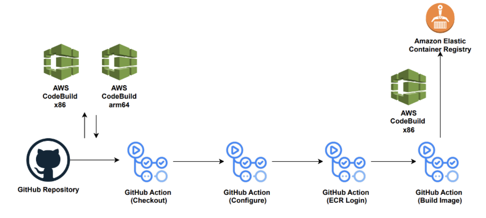
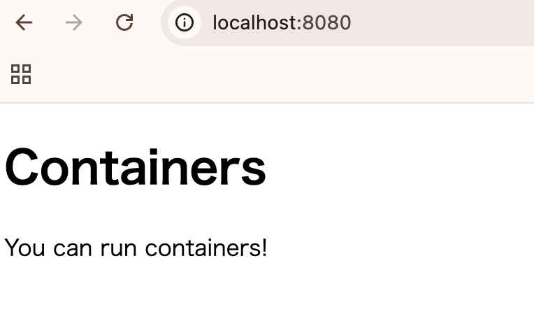
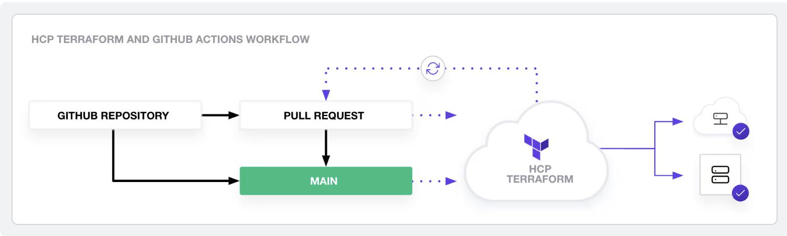
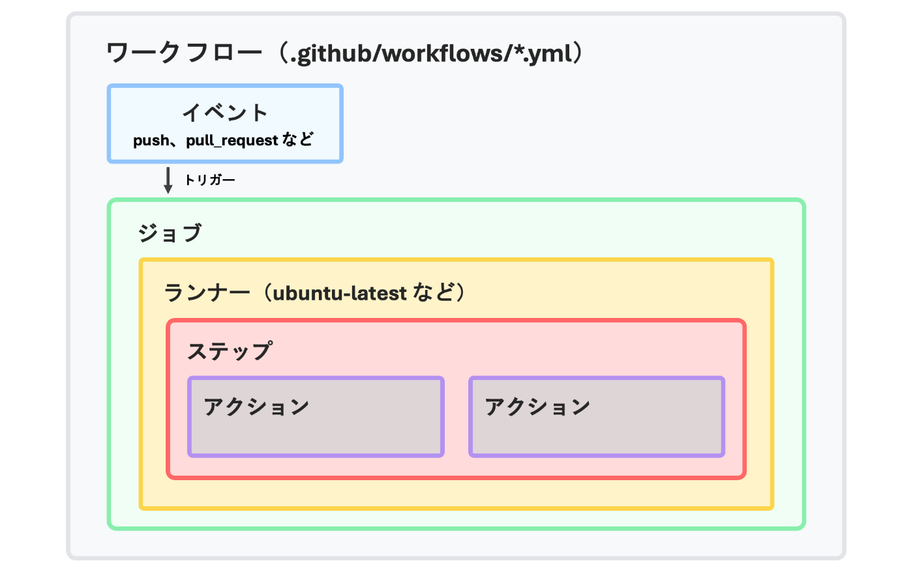

https://aws.amazon.com/jp/blogs/news/building-multi-arch-containers-with-github-actions-in-aws/

このURLを元に、GitHubを用いたCI/CDシステムについて学習する。



とりあえず一旦リポジトリを作成して試してみる

PC変えたのでdockerが入ってなかった。入れ直した



ローカルでdocker buildしたところ問題なく起動。

```dockerfile
FROM public.ecr.aws/nginx/nginx
COPY index.html /usr/share/nginx/html/index.html
EXPOSE 8080
CMD ["nginx", "-g", "daemon off;"]
```

`nginx`というのはエンジンエックスと読むらしく、オープンソースのWebサーバとのこと。
https://nginx.org/en/

awsの公式イメージを引っ張ってきて、`index.html`を /usr/share/nginx/html/にコピー。
コマンドを動かすという構成みたいだが、だいぶ変わっているような気がする。

ローカルで動かす時には
`docker run --rm -p 8080:80 my-nginx`
と打てと言われたが、dockerfileでEXPOSE 8080としているのに、こっちでもオプションでポートをしていているのはなぜなんだ

EXPOSEは特に意味のある命令ではない？？
https://docs.docker.jp/engine/reference/builder.html#expose


こっちの記事の方がやりたいことと近いのでこっちにします

https://developer.hashicorp.com/terraform/tutorials/automation/github-actions




まさにこれがやりたい

https://zenn.dev/farstep/books/learn-github-actions/viewer/basic-concepts-of-github-actions

その前にGitHub Actions全然イメージないので、これをみるとこからやるか

```yaml
name: Simple Workflow
on:
  push:
    branches: [main]
jobs:
  build:
    runs-on: ubuntu-latest
    steps:
      - uses: actions/checkout@v4
      - name: Run a script
        run: echo "Hello, World!"
```
yamlを使ってワークフローを`.github/workflow/`に定義する感じっぽい
GitHubに何かをした時に、それをトリガーして、jobsを実行する感じね


```yaml
on:
  push:
    branches: [main]
  pull_request:
    branches: [main]
----------
on:
schedule:
  - cron: "30 5,17 * * *"
```

これがイベント。リポジトリイベントとかスケジュールイベント、手動トリガーイベントとか色々なハンドラが用意されている。

ところで、`name`と`jobs`が同じ階層にあるということは、ワークフローはyamlファイル1つにつき1つ定義することができるという感じなのかな

```yaml
jobs:
  setup:
    runs-on: ubuntu-latest
    outputs:
      output1: ${{ steps.step1.outputs.result }}
    steps:
      - run: ./setup.sh

  build:
    needs: setup
    name: Build Application
    runs-on: ubuntu-latest
    env:
      VERSION: 1.0.0
    if: github.ref == 'refs/heads/main'

  test:
    needs: [build]
    runs-on: ubuntu-latest
    steps:
      - run: ./test.sh
```
これがjob
やれることがだいぶTerraformに近いというか、だいぶtfとの互換性を感じる

```yaml
steps:
  - name: Print a message
    run: echo "Hello, World!"

  - name: Multi-line script
    run: |
      echo "First line"
      echo "Second line"
      echo "Third line"
```
ステップは、ジョブ内で実行される個々のタスクを表す最小の実行単位です。各ステップは順番に実行され、一つのステップが失敗すると、通常そのジョブは中断されます。

```yaml
steps:
  - uses: actions/checkout@v4
    with:
      repository: "myorg/myrepo"
      ref: "main"
```
`actions/checkout@v4`などのよくわからんやつはアクションというもので、別の場所で定義されたステップを関数みたいに使用したくなるはずで、それをアクションと呼んでいるのかな

```yaml
jobs:
  build:
    runs-on: ubuntu-latest
    steps:
      - run: echo "Running on GitHub-hosted runner"
```
どうやらGitHub Actionsはプライベートリポジトリでやると色々制限が大きいらしいので、パブリックで別のリポジトリ作ってやってみる。

実際にやってみる。
```yaml
steps:
  - uses: actions/checkout@v4
  - name: Set up Node.js
    uses: actions/setup-node@v4
    with:
      node-version: "20"
  - name: Install dependencies
    run: npm install
```
```yaml
steps:
  - name: Deploy to production
    if: github.ref == 'refs/heads/main'
    run: npm run deploy
```